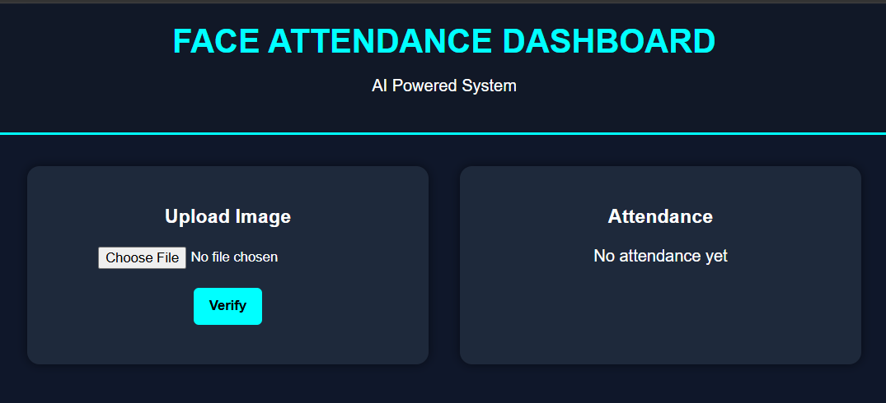
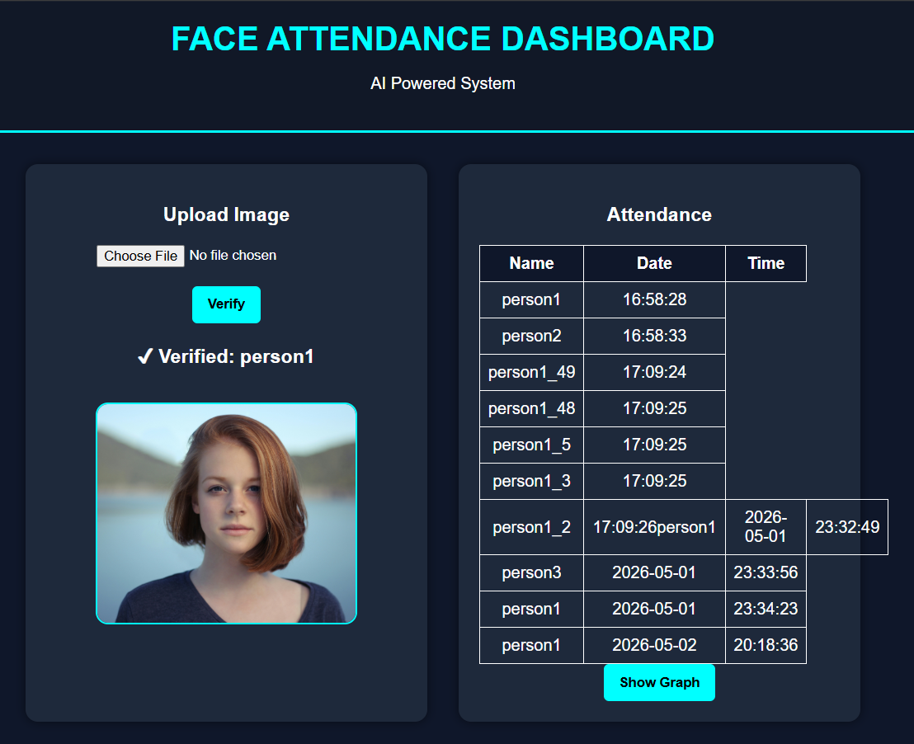
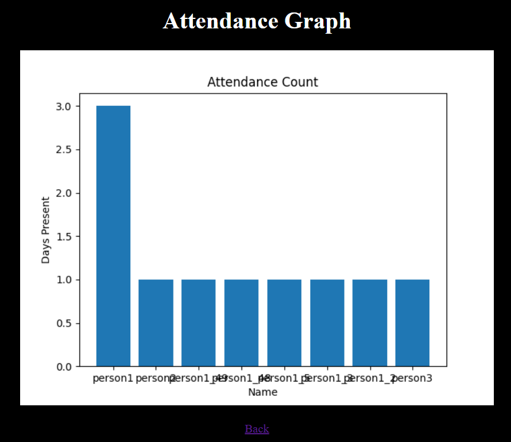

# 🎯 AI Face Attendance System

An intelligent **Face Recognition-based Attendance System** built using Python, Computer Vision, and Web Technologies.
This project automates attendance marking using facial recognition and provides a **modern dashboard with analytics**.

---

## 🚀 Features

* 🤖 Face Detection & Recognition using OpenCV
* 📋 Automatic Attendance (Name, Date, Time)
* 🖥 Desktop Application (Custom UI)
* 🌐 Web Dashboard using Flask
* 🖼 Image Upload with Preview
* 📊 Attendance Analytics (Graph Visualization)
* ❌ Duplicate Attendance Prevention (per day)
* 🎨 Clean & Modern Dashboard UI

---

## 🧠 Tech Stack

* Python
* OpenCV
* NumPy
* Flask
* HTML, CSS
* Matplotlib

---

## 📂 Project Structure

```
Face_Attendance_System/
│
├── app.py                # Web Application (Flask)
├── main.py               # Desktop Application
├── capture.py            # Image Capture Script
├── attendance.csv        # Attendance Data
│
├── images/               # Training Images
├── static/
│   ├── uploads/          # Uploaded Images
│   └── graph.png         # Generated Graph
│
├── templates/
│   ├── index.html        # Dashboard UI
│   └── graph.html        # Graph Page (if used)
│
├── screenshots/          # Project Screenshots
└── README.md
```

---

## ⚙️ How It Works

1. **Training Phase**

   * System loads images from the `images/` folder
   * Converts them to grayscale
   * Trains LBPH Face Recognizer model

2. **Face Detection**

   * User uploads an image via dashboard
   * Haar Cascade detects face in the image

3. **Face Recognition**

   * Model compares detected face with trained data
   * If match found → person is verified

4. **Attendance Marking**

   * Stores:

     * Name
     * Date
     * Time
   * Prevents duplicate entries for same day

5. **Dashboard Update**

   * Attendance table updates dynamically
   * Uploaded image preview shown

6. **Analytics**

   * Graph generated using attendance data
   * Shows number of उपस्थित days per person

---

## 🖥️ Running the Project

### 1️⃣ Install Dependencies

```
pip install opencv-python numpy flask matplotlib
```

### 2️⃣ Run Web App

```
python app.py
```

### 3️⃣ Open in Browser

```
http://127.0.0.1:5000
```

---

## 📸 Screenshots

### Dashboard



### Face Verification



### Analytics Graph



---

## 🎥 Demo Video

👉 demo video link below:

```
https://www.linkedin.com/posts/deepika-gautam-a0ab92327_hexsoftwares-ai-machinelearning-ugcPost-7456367352516059136-wJy8?utm_source=share&utm_medium=member_desktop&rcm=ACoAAFKUICoBWQ1y1WUWHG2wbmv8s60TktI6LV0

```

---

## 💡 Future Enhancements

* 📸 Live Webcam Integration
* 🔐 User Authentication System
* ☁ Cloud Deployment
* 📱 Mobile Responsive UI
* 🧠 Deep Learning Face Recognition

---

## 👩‍💻 Author

**Deepika Gautam**

* Python Developer | AI/ML Enthusiast
* Skilled in Python, HTML, CSS

---

## ⭐ Conclusion

This project demonstrates the practical implementation of **Artificial Intelligence in real-world automation systems**, combining computer vision, web development, and data analytics into a single powerful application.

---

## 📌 Note

* Make sure images in `images/` folder are clear
* Keep `attendance.csv` clean before pushing
* Add your demo video link before sharing

---
